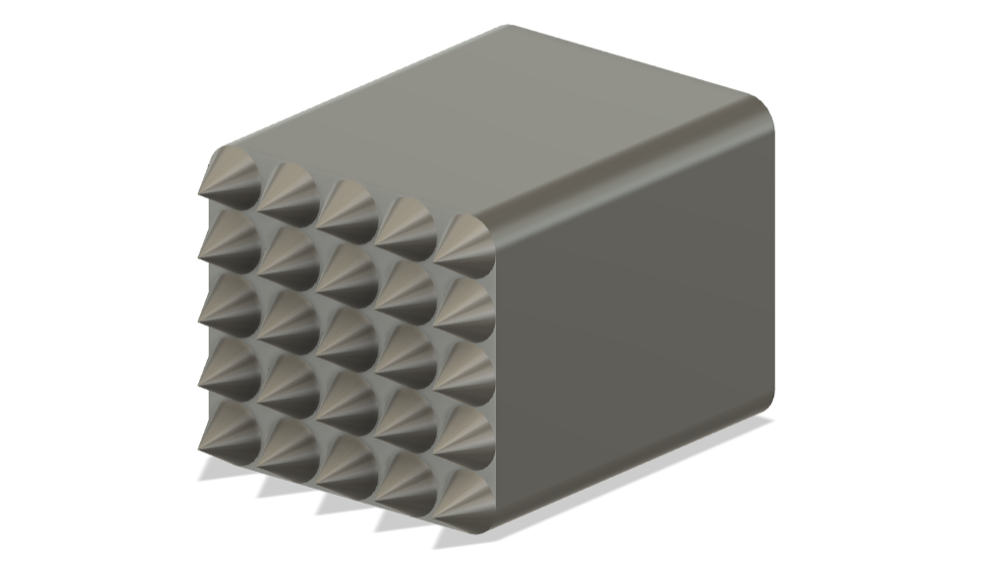

# Spiky wall for mouse treadmills

This is a parametric design of a spiky wall to be used with mouse treadmills.

Adjust dimensions using the `change parameters` menu in [Fusion 360][Fusion360] to match the dimensions of your treadmill.

## Components
- PLA
- Prusa i3 MK3S+

## Build instructions
- Adjust dimensions of the `f3d` file using [Fusion 360][Fusion360], export to `3mf`, and generate the `gcode` using [Prusa Slicer][PrusaSlicer].
- Copy `gcode` file to an SD card and print.

## Version History
### 0.1.0
* 2023-12-13
  - Initial Release.

## License
© 2023 [Leonardo Molina][Leonardo Molina]

This project is licensed under the [Creative Commons BY-NC-SA 4.0 License](https://creativecommons.org/licenses/by-nc-sa/4.0/).

[Leonardo Molina]: https://github.com/leomol
[LICENSE.md]: LICENSE.md
[Fusion360]: https://www.autodesk.com/ca-en/products/fusion-360
[PrusaSlicer]: https://help.prusa3d.com/downloads